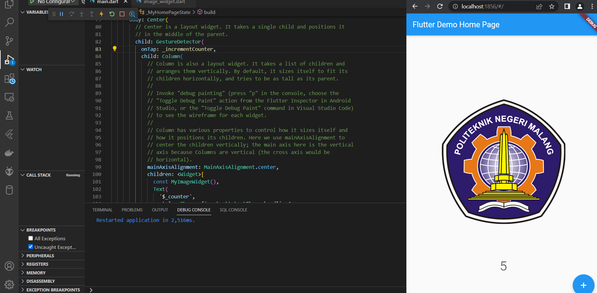
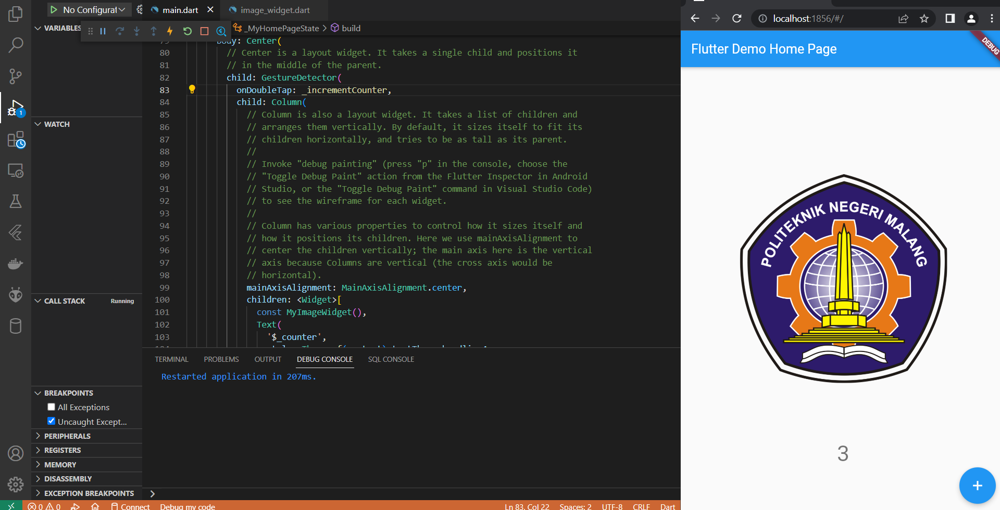
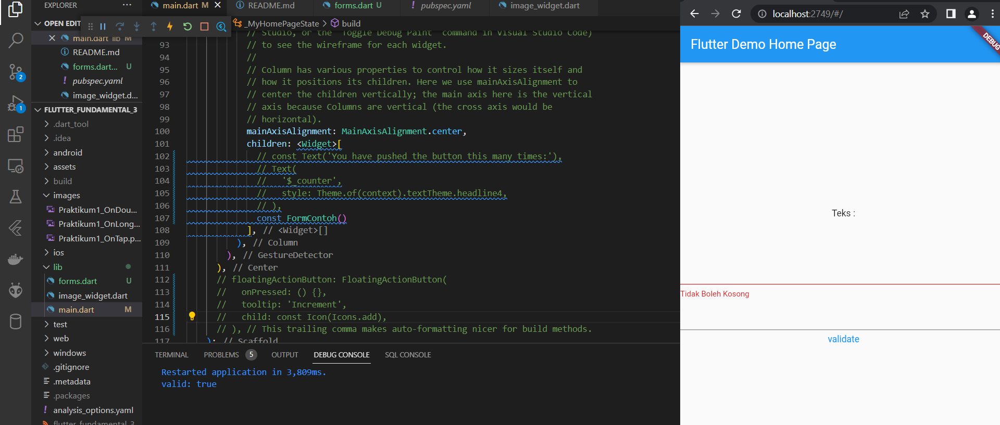
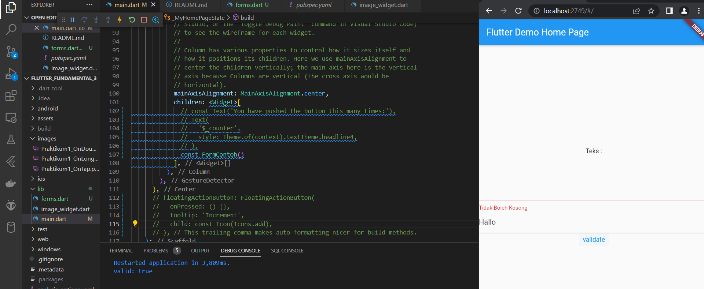
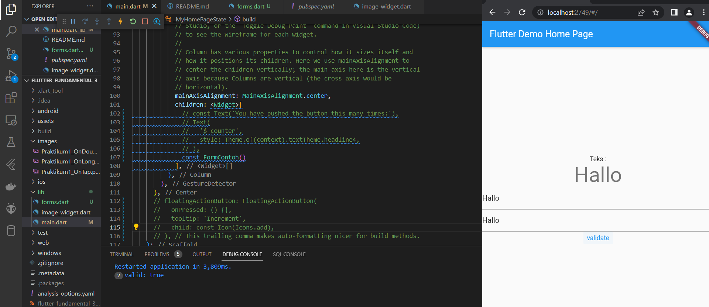
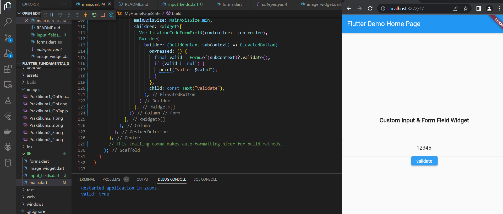
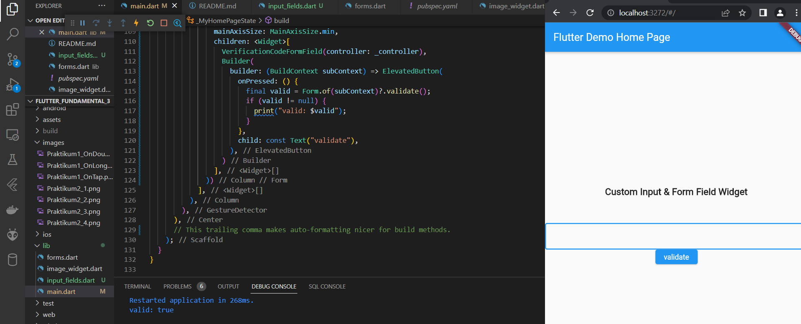
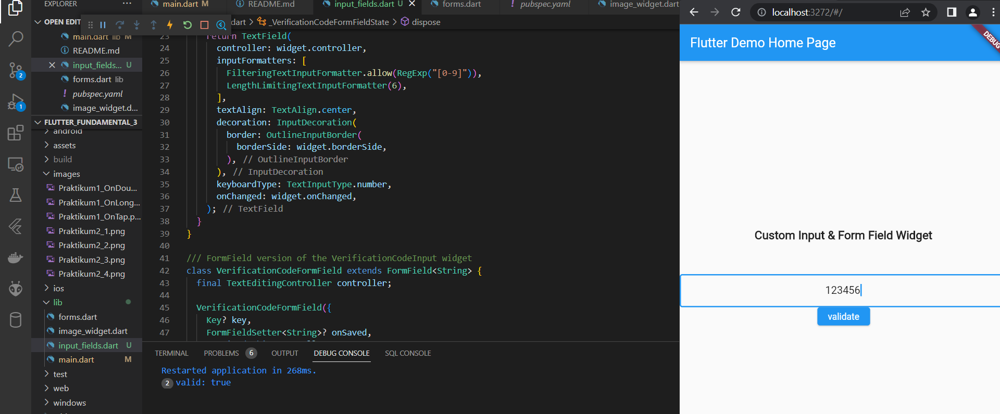

# flutter_fundamental_3

#Rajendra Rakha A P

Praktikum 1: Menerapkan Gesture Detector

- On Tap: Mengklik hanya satu kali

- On Double Tap: Mengklik 2 kali

- On Long Press: Menahan beberapa detik

Praktikum 2: Menerapkan Input Widget dan Forms

- Validasi digunakan dalam form , jika form tidak sesuai validasi akan diberikan peringatan / pemberitahuan

Praktikum 3: Menerapkan Custom Input dan FormField Widget

- Custom input ini hanya memperbolehkan angka 1-9 saja untuk diinputkan karena terdapat validasi yang mengatur jika input max 9 dan untuk text adalah 9 

